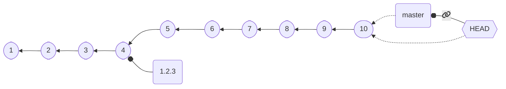
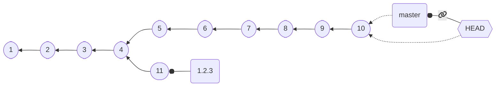
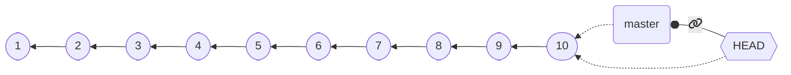
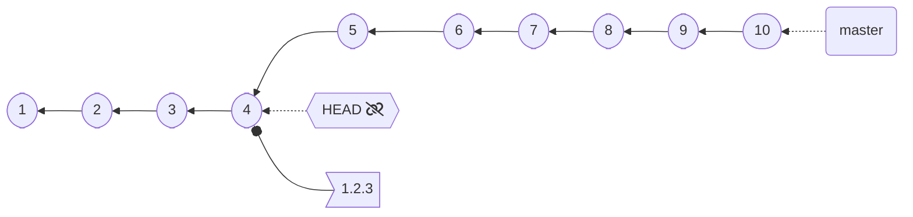

## Branches as attachable (and movable) labels

Looks good, but if we do something like: ⬇️ `git checkout 1.2.3` [some changes] `git commit` ⬇️

Our version **moved**, *we never want this to happen*!

---

## Tagging

The `tag` subcommand to create *permanent labels* attached to commits.
Tags come in two fashions:
* **Lightweight** *tags* are very similar to a "permanent branch": *pointers to commits that never change*
* **Annotated** *tags*  (option `-a`) store additional information: a *message*, and, optionally, a *signature* (option `-s`/`-u`)

⬇️ `git checkout C4 && git tag 1.2.3` ⬇️

`HEAD` cannot attach to tags!
